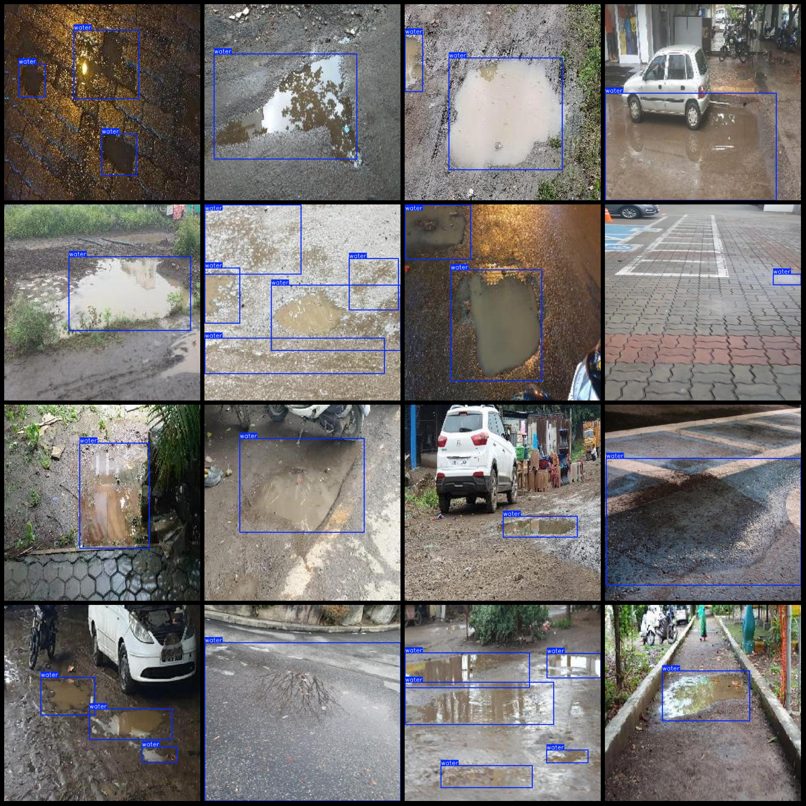
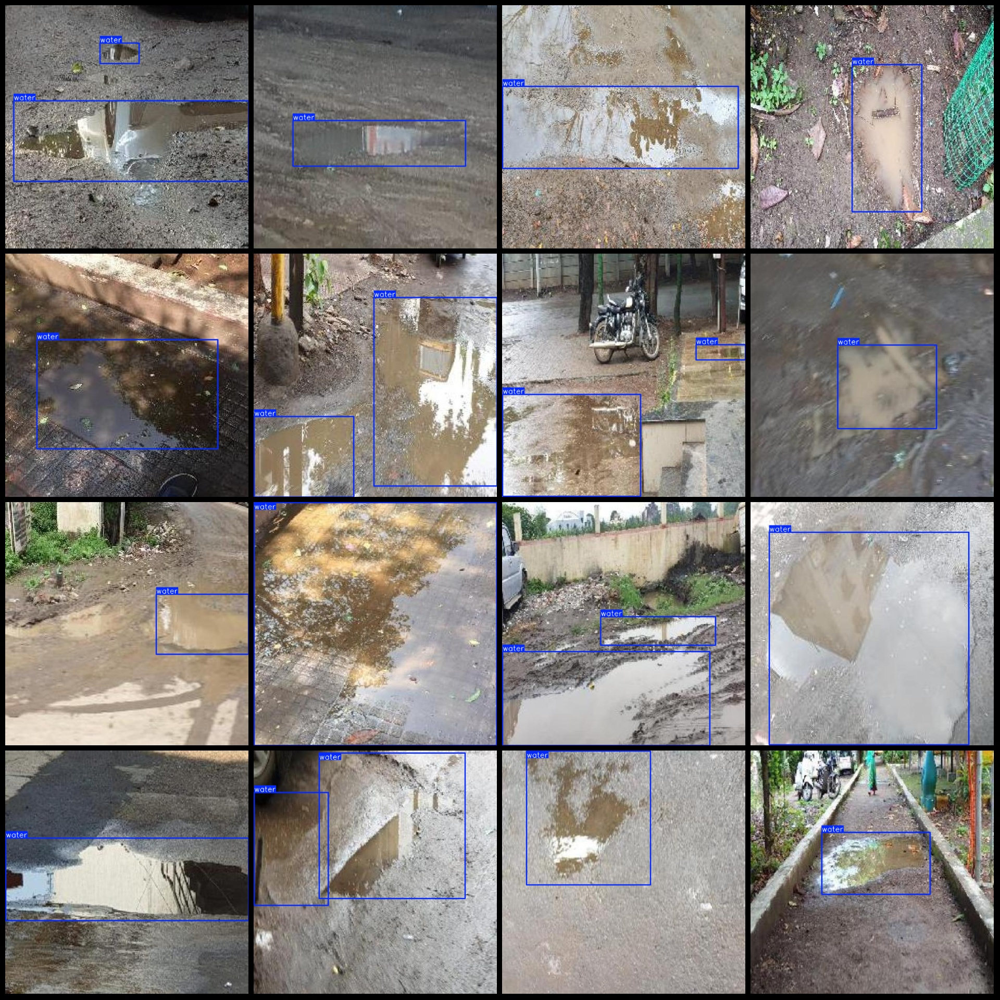

# Intelligent Traffic City Road Water Logging Detection Dataset - Pascal VOC+YOLO Format, 1544 Categories

**Dataset Format:** Pascal VOC format + YOLO format (excluding the segmentation path in the txt file, only containing jpg images and corresponding VOC format xml files and yolo format txt files)

**Number of Images (jpg Files):** 1544
**Number of Annotations (xml Files):** 1544
**Number of Annotations (txt Files):** 1544
**Number of Annotation Categories:** 1
**Annotation Category Name:** ["water"]
**Number of Boxes per Category:**
- water boxes = 2162
**Total Boxes:** 2162
**Number of Images per Category:**
- water images = 1544
**Image Resolution:** 640x640
**Annotation Tool Used:** labelImg
**Annotation Rules:** Drawing bounding box around the category
**Important Notice:** The dataset does not have split into training, validation, or test sets; you need to divide it yourself.
**Special Remark:** This dataset does not guarantee the accuracy of the trained models or weight files.
**Image Preview:**

**Annotation Example:**

## Images

Here is a pay link on Stripe ( https://buy.stripe.com/3cs8yP7sY87d0vu9AB ). Please contact me lonlonago@foxmail.com after funding $89, and I will send you a complete data files , thank you!

